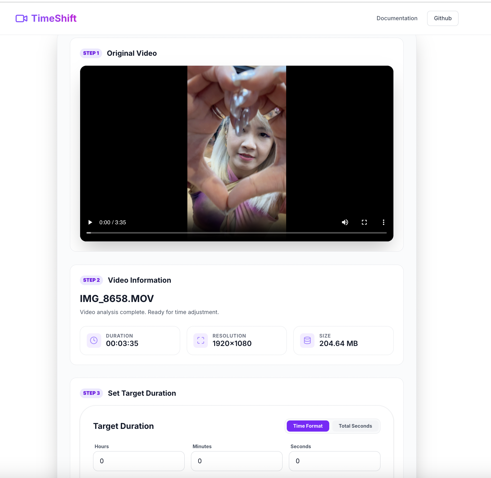
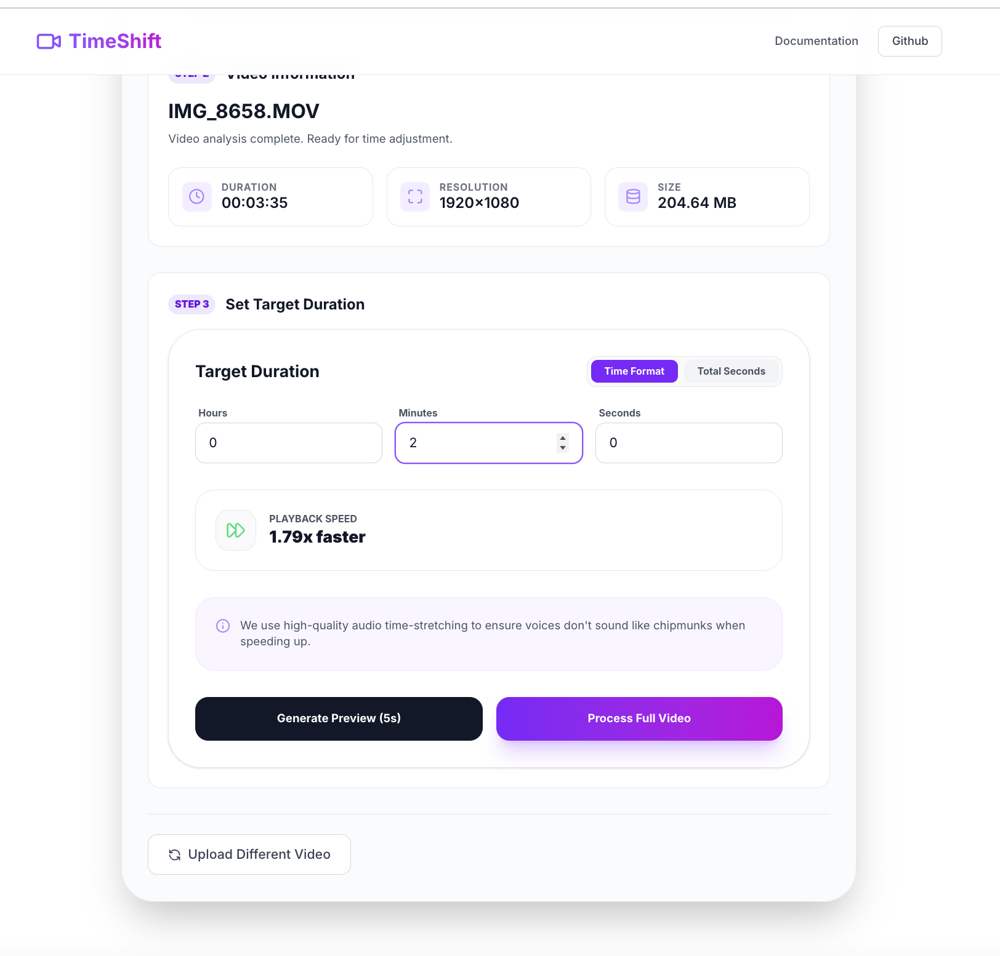
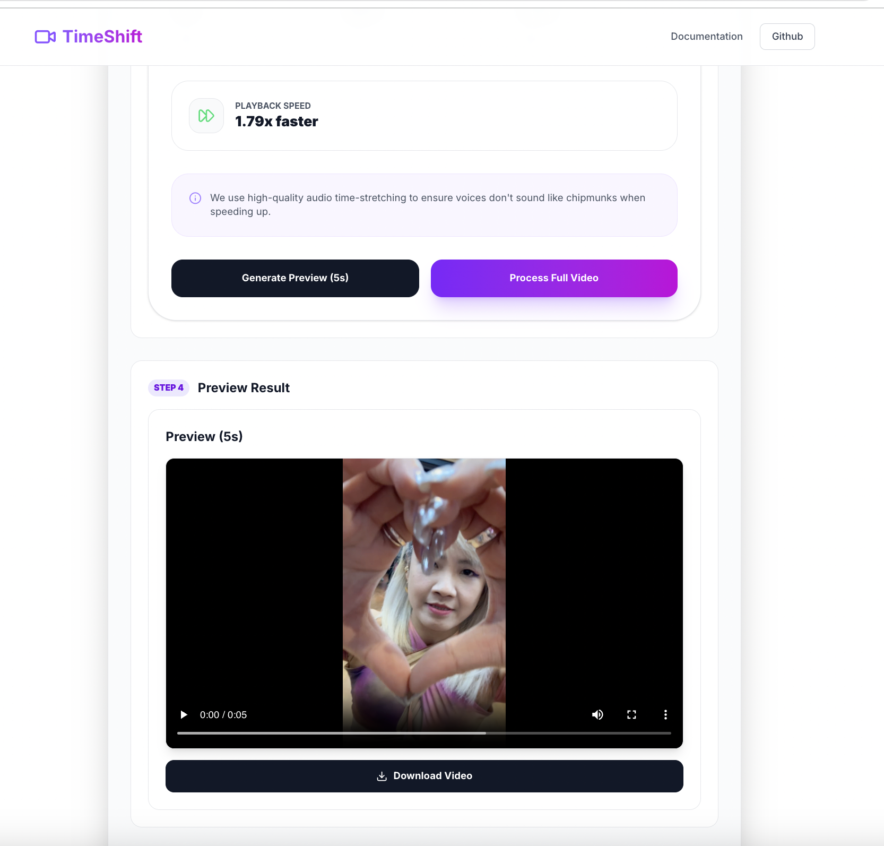
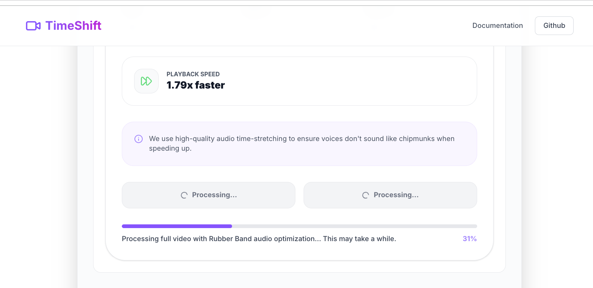
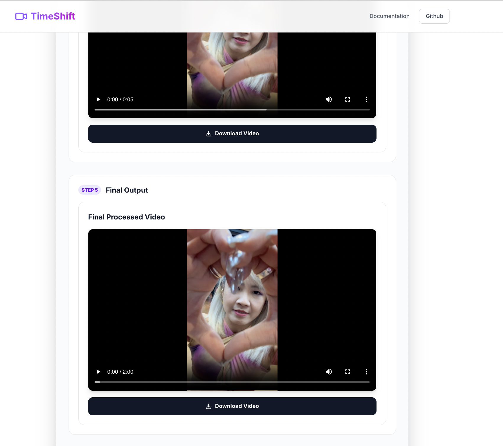

# Video Duration Adjuster

> Important: Before working on this project, read [AGENTS.md](AGENTS.md) for required workflows and tooling expectations.

## Usage Guide

### Step 0 — Landing Page


When you first open the app at `http://localhost:3000`, you are greeted with a clean landing page. The headline reads **"Manipulate Time in Seconds."** and a drag-and-drop upload zone is displayed in the center. You can either drag a video file onto the zone or click it to browse your files. Supported formats are **MP4**, **MOV**, and **WEBM**.

---

### Step 1 — Uploaded Video with Information



After uploading a video, the app automatically analyzes the file and displays:

- **Original Video** — an embedded player so you can review the source footage.
- **Video Information** — file name, duration, resolution, and file size are shown.

This gives you a clear picture of the input before you make any changes.

---

### Step 2 — Set the Output Duration



In **Step 3** of the UI panel, enter your desired target duration. You can toggle between two input modes:

- **Time Format** — specify hours, minutes, and seconds separately.
- **Total Seconds** — enter a single number representing the total seconds.

A **Playback Speed** indicator updates in real time, showing you the resulting speed ratio (e.g., *1.5× faster*). If the speed change is extreme, a warning message appears to let you know quality may be affected.

Below the controls you will find two action buttons:

| Button | Description |
|--------|-------------|
| **Generate Preview (5s)** | Creates a short 5-second preview clip so you can check the result before committing to the full conversion. |
| **Process Full Video** | Processes the entire video at the specified target duration. |

---

### Step 3 — 5-Second Preview (Optional)



If you click **Generate Preview (5s)**, the app renders a short clip with the new speed applied. A video player appears under **Step 4 — Preview Result**, allowing you to watch and download the preview. This is optional — you can skip directly to processing the full video if you prefer.

---

### Step 4 — Processing & Output Result



When you click **Process Full Video**, a progress bar and status text appear showing the current stage (e.g., *Adjusting audio speed…*) and completion percentage. The app uses high-quality audio time-stretching (rubberband) to preserve natural pitch, and optical-flow interpolation for smooth video frame adjustment.

---

### Step 5 — Final Processed Video



Once processing is complete, **Step 5 — Final Output** appears with:

- An embedded video player for the processed result.
- A **Download Video** button to save the output file to your machine.

You can also click **Upload Different Video** at the bottom to start over with a new file.

---

## Getting Started

> Before making changes, read the project guidelines in [AGENTS.md](AGENTS.md).

This project is managed with [Poetry](https://python-poetry.org/).

### Prerequisites

Based on this project's dependencies, install the following system-level packages first via Homebrew (macOS):

```bash
brew install python@3.11 ffmpeg-full poetry
```

| Package | Reason |
|---------|--------|
| `python@3.11` | The project requires Python ~3.11 as specified in `pyproject.toml` |
| `ffmpeg-full` | Required for video processing and includes FFmpeg compiled with `--enable-librubberband` |
| `poetry` | Python dependency manager used to manage this project |

After installing Playwright (via `poetry install`), you also need to download browser binaries:

```bash
poetry run playwright install
```

This project currently uses `ffmpeg-full` on macOS for audio speed optimization.
Reason: the default `ffmpeg` formula may not include the `rubberband` filter, while `ffmpeg-full` is compiled with `--enable-librubberband`.
Because of this requirement, this project should use `ffmpeg-full` instead of the default `ffmpeg` formula.

```bash
brew install ffmpeg-full
```

### Installation

1. Ensure Poetry uses Python 3.11:

```bash
poetry env use python3.11
poetry env info
```

2. Install dependencies:

```bash
poetry install
```

### Running the App

Start the development server:

```bash
poetry run ./reflex_rerun.sh
```

The application will be available at `http://localhost:3000`.

### Clean Rebuild & Run

To fully clean the environment, reinstall all dependencies, and start the app in one step:

```bash
./proj_reinstall.sh --with-rerun
```

This will remove existing Poetry virtual environments and Reflex artifacts, recreate the environment from scratch, and automatically launch the app afterwards.

## Frame Interpolation Approach

This project uses **CPU-based Optical Flow Interpolation** to generate intermediate frames when adjusting video duration.

An alternative approach using **RIFE v4.22** with **Apple Silicon M4 GPU acceleration** (Metal / Core ML) for deep-learning-based frame interpolation was explored in [PR #1](https://github.com/milochen0418/video_duration_adjuster/pull/1). After experimentation, the GPU-accelerated RIFE deep learning method on Apple Silicon did not outperform the current CPU-based **Optical Flow Interpolation** approach in terms of output quality. Therefore, Optical Flow Interpolation remains the default and recommended approach.

**Keywords:** RIFE v4.22, Apple Silicon, M4, GPU acceleration, Optical Flow Interpolation

